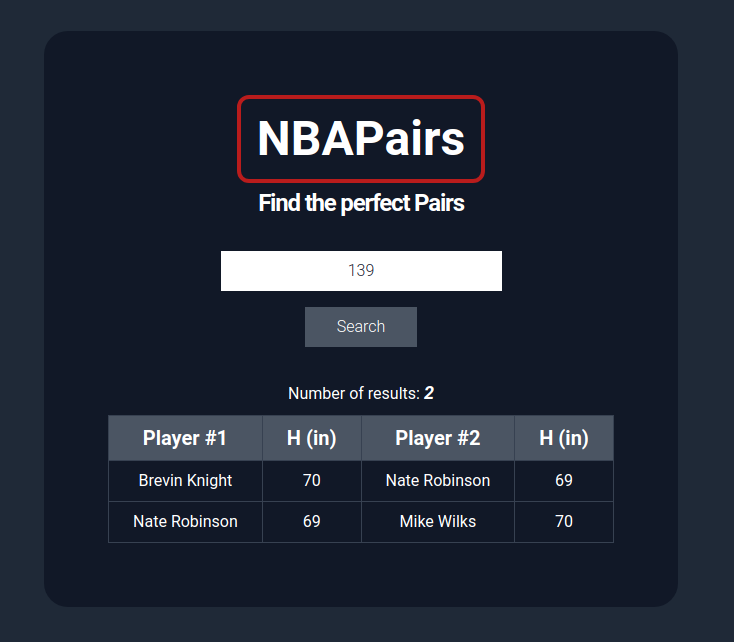

# NBAPairs

> This project searches through NBA players heights based on user input.

This application takes a single integer to input. The application will download the raw data from the website `https://www.openintro.org/data/index.php?data=nba_heights` and print a list of all pairs of players whose height in inches adds up to the integer input to the application.

The data is served in json format by the endpoint `https://mach-eight.uc.r.appspot.com/`

## Built With

- React.js
- Tailwindcss
- Jest

## Live Demo

[Live Demo Link](https://nba-pairs.netlify.app/)

## Getting Started

### Prerequisites

- NPM installed/added to your PATH

### Setup

- `git clone https://github.com/fernandorpm/space-travelers-hub.git`
- `cd nba-pairs`

### Install

- `yarn install`

### Usage

- `yarn start`
- You can use the search input to find players whose height adds up to your search.

### Run tests

- `yarn test`

👤 **Daniel Jaramillo**

- GitHub: [@d4nielj](https://github.com/d4nielj)
- Twitter: [@d4niel_jm](https://twitter.com/d4niel_jm)
- LinkedIn: [d4nielj](https://linkedin.com/in/d4nielj)

## 🤝 Contributing

Contributions, issues, and feature requests are welcome!

Feel free to check the [issues page](../../issues/).

## Show your support

Give a ⭐️ if you like this project!

## 📝 License

This project is [MIT](./LICENSE) licensed.
